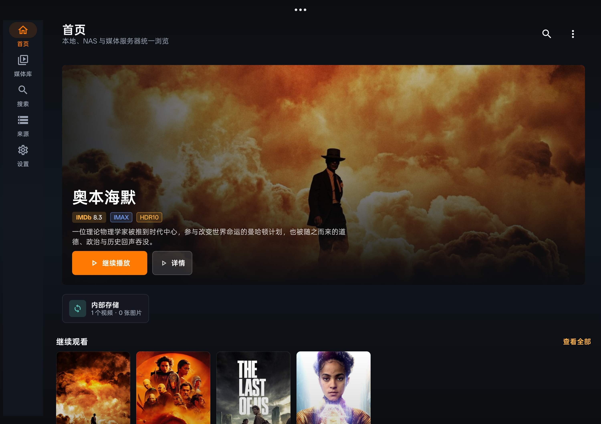
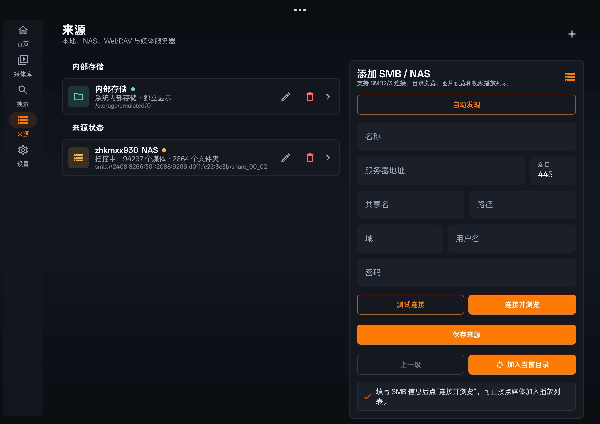
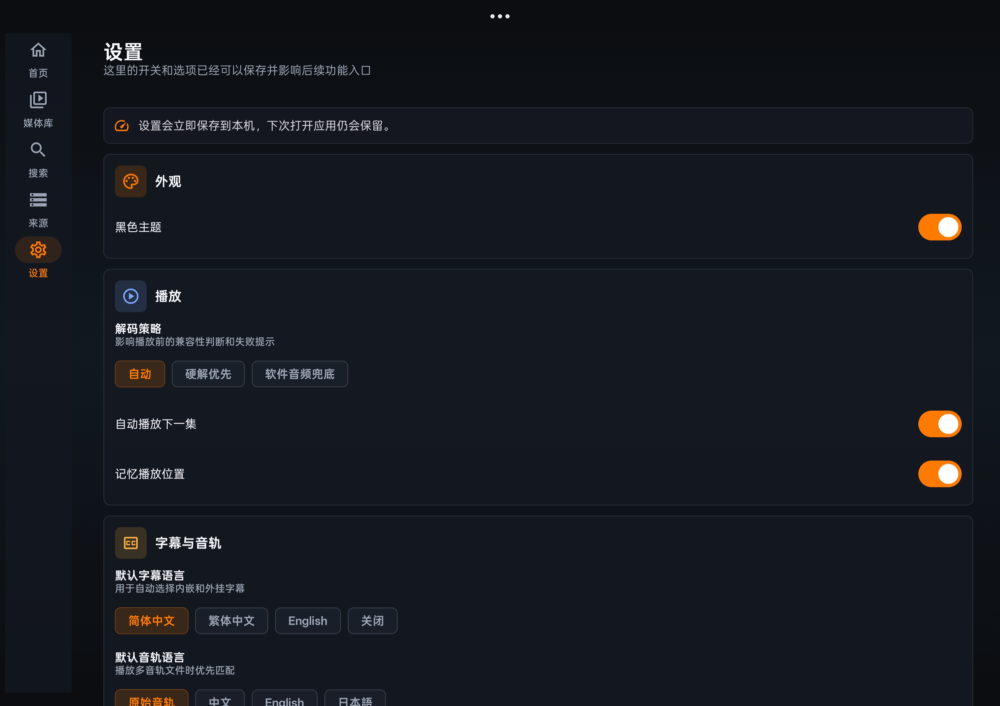
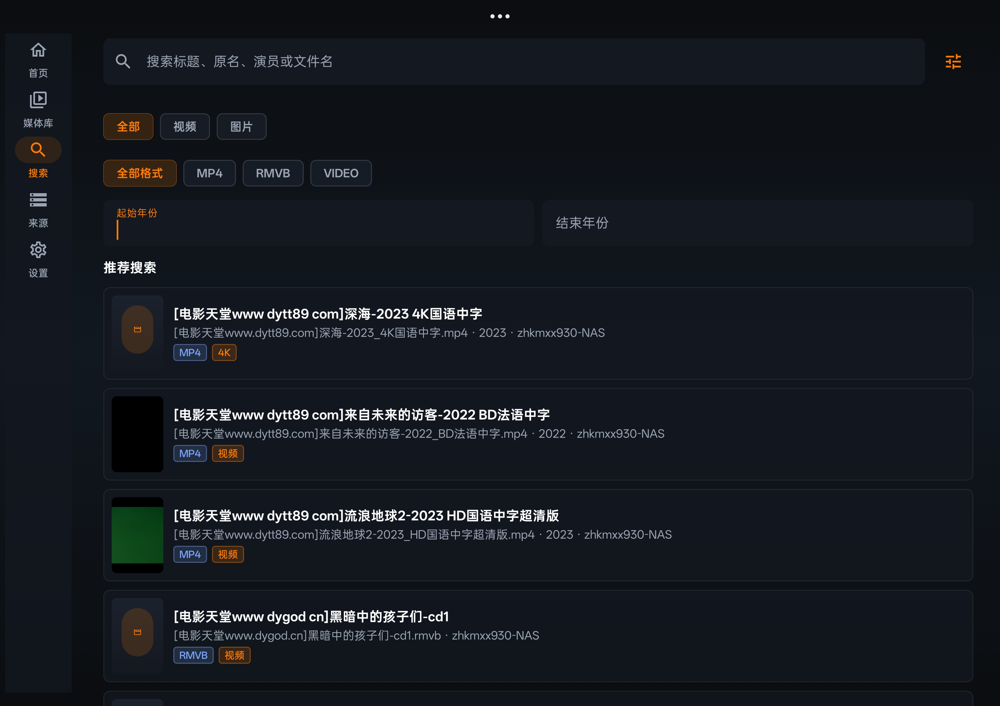
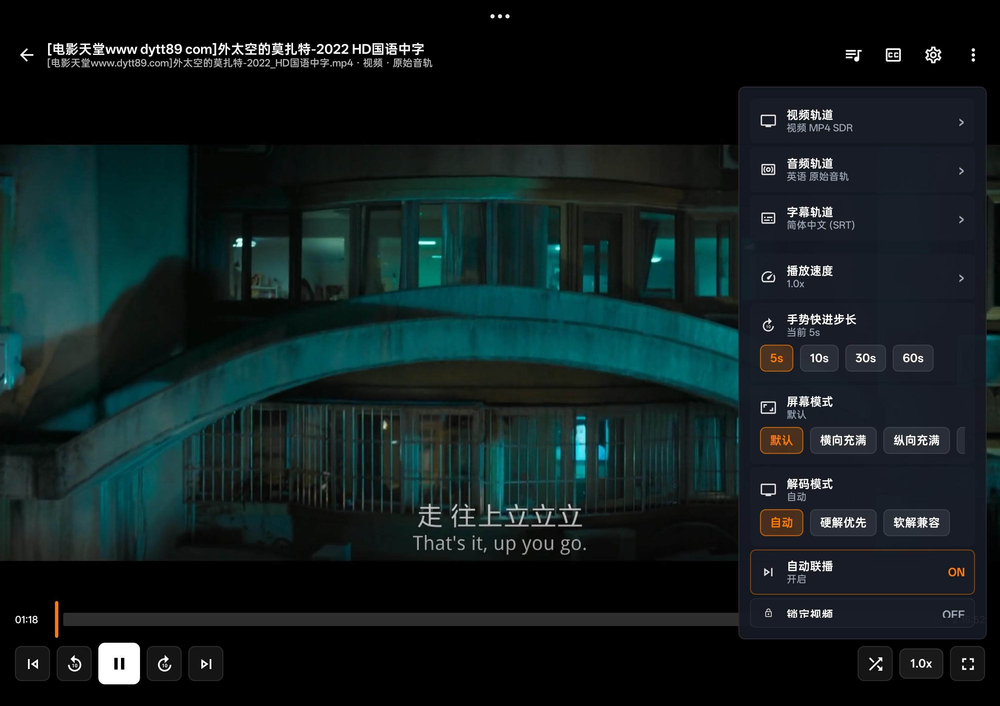

# outfuse

outfuse is a personal media library player designed for Android phones and tablets. Its goal is to organize videos and images from local files, LAN shares, and network storage into a quiet, fast, and easy-to-browse media center. The project is built with Kotlin, Jetpack Compose, and AndroidX Media3, and is well-suited for further expansion into a home media library, NAS media browser, or mobile photo/video player.

Targeting similar Android media players, it primarily focuses on NAS video and image viewing rather than dedicated metadata scraping.

## Features

- Adaptive UI for phones and tablets: bottom navigation, side navigation, landscape playback, and large-screen grid layouts.
- Media library management: video/image statistics, source switching, type filtering, name/date sorting, and list/large thumbnail/small thumbnail layouts.
- Thumbnail capabilities: supports native image preview and cached video screenshot thumbnails.
- Source management: supports internal storage, SMB/NAS sources, background scanning, scan progress tracking, source editing, and deletion confirmation.
- File browsing: navigates source directories via filesystem hierarchy, supports sorting, layout switching, and basic file management operations.
- Playback experience: Media3 player, playlists, shuffle/sequential playback, double-tap to pause, swipe to seek, brightness/volume gestures, long-press to speed up, and a playback settings overlay.
- Image viewing: full-screen display, swipe browsing, and two-finger pinch-to-zoom.
- Personalization: black/white theme, home page display options, seek step size, metadata and cover art strategies, cache management, and Trakt link entry.
- Format support: designed around common video, image, and LAN media scenarios, with continuous additions for formats like mpg, avi, mov, gif, mkv, flv, wmv, etc.







## Tech Stack

- Kotlin
- Jetpack Compose
- AndroidX Media3 / ExoPlayer
- Coil
- SMBJ
- Kotlin Coroutines
- Gradle Kotlin DSL

## Project Structure

- `app/src/main/java/com/outfuseplayer/model`: Models for media, sources, playback, and library.
- `app/src/main/java/com/outfuseplayer/data`: Data layer for media library, sources, settings, thumbnails, playback progress, etc.
- `app/src/main/java/com/outfuseplayer/data/smb`: SMB configuration, browsing, scanning, and file operations.
- `app/src/main/java/com/outfuseplayer/playback`: Player data sources and remote media reading.
- `app/src/main/java/com/outfuseplayer/ui`: App navigation, file operations, view configuration, and theming.
- `app/src/main/java/com/outfuseplayer/ui/screens`: Screens including Home, Media Library, Search, Sources, Details, Playback, and Settings.

## Build

Recommended environment:

- Latest stable version of Android Studio
- JDK 17
- Android SDK 35
- Gradle Wrapper using the version bundled with the repository

Debug build:

```powershell
.\gradlew.bat :app:assembleDebug
```

Release build:

```powershell
.\gradlew.bat :app:assembleRelease
```

The Release APK will be output to:

```text
app/build/outputs/apk/release/outfuse-0.1.0-release.apk
```

## Open Source Notice

outfuse is designed for personal, lawful media library playback and management. It does not include built-in content sources, does not provide pirated resources, does not bypass DRM, and does not decrypt protected content. Before formal public release, it is recommended to add a clear `LICENSE` file, contribution guidelines, and a privacy policy.

## Roadmap

- Improve automatic discovery for additional network protocols.
- Enhance incremental indexing and crash recovery for large media library scans.
- Add more comprehensive metadata scraping, cover art matching, and local-first strategies.
- Refine advanced codec support, audio capability indicators, and device compatibility notices.
- Introduce automated testing and CI/CD pipelines.
